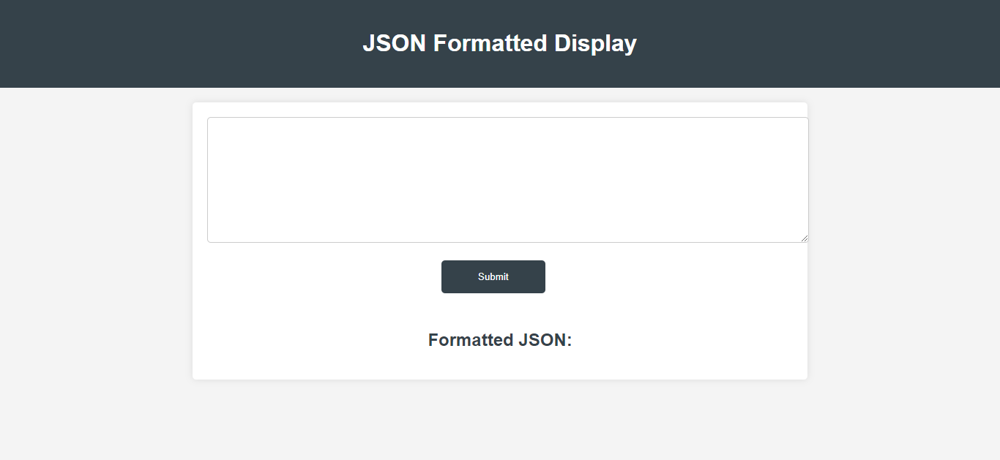
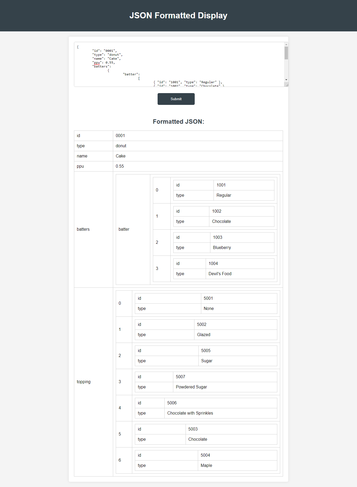

# JSON Formatted Display

A simple web application that takes JSON data as input and displays it in a formatted table structure.

## Table of Contents

- [Description](#description)
- [Technologies Used](#technologies-used)
- [Setup](#setup)
- [Usage](#usage)
- [Screenshots](#screenshots)
- [License](#license)

## Description

This project provides a user-friendly interface to input JSON data and visualize it in a structured table format. The JSON data can contain nested objects, which will be displayed as nested tables within the main table.

## Technologies Used


## Setup

1. Clone the repository to your local machine.
2. Navigate to the project directory in your terminal.
3. Install the required dependencies using:
```
npm install
```
4. Start the server using:
```
node index.js
```

5. Open your web browser and navigate to `http://localhost:3000` to access the application.

## Usage

1. Enter your JSON data in the provided textarea.
2. Click the "Submit" button.
3. The submitted JSON data will be displayed in a formatted table structure.
4. If the JSON data contains nested objects, they will be displayed as nested tables.

## Screenshots




## License

This project is licensed under the [MIT License](LICENSE).
